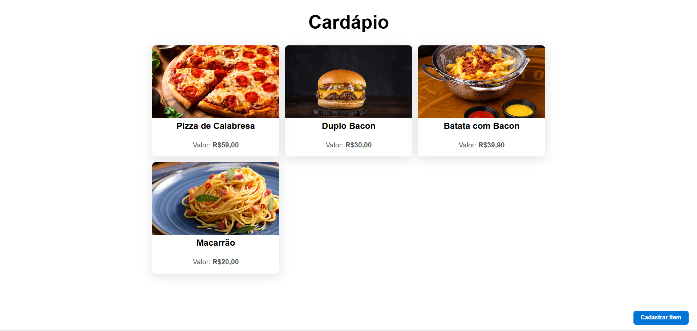
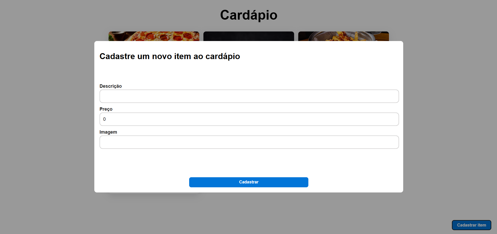

# 📋 Cardapio Digital

Este projeto é uma aplicação fullstack de um cardápio digital, onde os usuários podem cadastrar e visualizar itens como imagem, nome e preço. A aplicação é projetada para ser intuitiva, funcional e de fácil manutenção, utilizando tecnologias modernas para garantir performance e escalabilidade.

  
  

## 🛠️ Tecnologias Utilizadas

### 🌐 Frontend

- **React:** Biblioteca JavaScript para construção de interfaces de usuário.
- **React Query:** Gerenciamento eficiente de estados assíncronos e cache de dados remotos.
- **TypeScript:** Superset de JavaScript que adiciona tipagem estática.
- **CSS3:** Linguagem de estilo para definir a apresentação dos documentos HTML.
- **HTML5:** Linguagem de marcação para construção de páginas web.
- **Vite:** Ferramenta de build rápida para desenvolvimento frontend.
- **Axios:** Cliente HTTP para consumo de APIs de forma simples e eficiente.

### ⚙️ Backend

- **Java:** Linguagem de programação robusta e amplamente utilizada para desenvolvimento de aplicações.
- **Spring Boot:** Framework para criação de APIs REST escaláveis e performáticas.
- **PostgreSQL:** Banco de dados relacional avançado, garantindo persistência e integridade de dados

## 🚀 Funcionalidades

- **Cadastro de itens:** Permite o registro de novos produtos, com upload de imagens, definição de nomes e preços.
- **Visualização de cardápio:** Apresenta os itens cadastrados de forma organizada e atraente.
